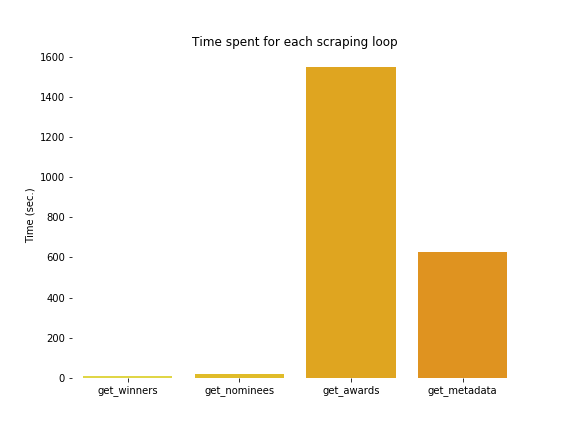
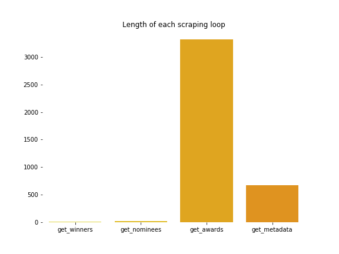
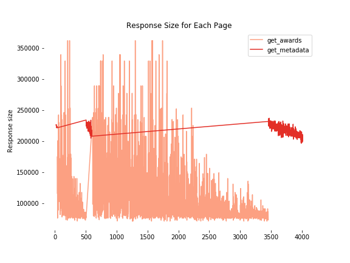
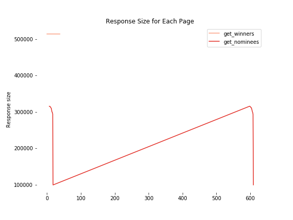
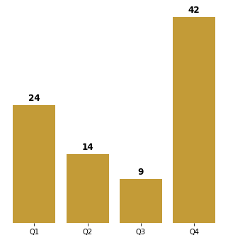

# Predicting Academy Award winners in the category 'Best Picture'
This paper seeks to train a predictive model of Oscar movies in the category *Best Picture* in order to compute a probabilistic outcome of whether the classifier can correctly predict if a movie is awarded a *Best Picture* Oscar award. The movie database website \textit{www.IMDB.com} is scraped using the *BeautifulSoup* library, where data for all Oscar winning and nominated movies from 1927 until 2018 are scraped. The website is by far the largest database for movies and series with listings of various information of every movie and creators of it, involving aspect ratio, gross budget, gross earnings, genre, movie award, actor awards etc. These features lay the framework for our project in predicting Oscar winners. As the data set contains past observations of the winning and nominated movies, the predictive model is trained using supervised Machine Learning. We use a logistic regression classifier to compute a probabilistic outcome of whether our classifier can correctly predict whether a movie is awarded a *Best Picture* Oscar award.

## Scraping
The scraping took place on August 27th 2019 and includes 557 Oscar nominated and winning movies from 1927 until 2018, scraped from 39 pages. Each of the 557 movies had their main actors and director(s) IMDB awards page scraped as well; adding 3779 pages to the loop. Finally the additional data for each movie was scraped, adding 557 pages to the loop. This brings the total of pages scraped up to 4375.

The scraper compiled with the robots.txt file of IMDB, which states which sub-sites can't be scraped. The sub-sites which are off limits include, among others, image and video content, personal information pages and advertisement. 

 

The scraping loop consists of four main scraping loops; firstly the two large lists of Oscar winners and Oscar nominees are scraped; then each of the movies have their additional data scraped and finally each of the main actors and directors have their awards page scraped for the total amount of Oscars won and nominations in their total career.

Some older movies lack some information, especially the budget, which makes it harder to compare all movies equally on those variables. All lacking information are replaced with *NaN* values, and are later dropped from the dataframe.

 

The figures above shows the time spent for each scraping loop and the length of loop responses.  A clear correlation between the two is seen, where the longer the responses are, themore time is spent scraping. The table below lists the length of the loop, mean delta t for each page and mean response size for each page.

<center>
    
|                    | Get_winners | Get_nominees | Get_awards | Get_metadata |
|--------------------|-------------|--------------|------------|--------------|
| Length             | 8           | 24           | 3315       | 668          |
| Mean delta t       | -1.14       | -0.84        | -0.47      | -0.94        |
| Mean response size | 514332      | 290803       | 108173     | 218393       |

</center>

## Descriptive statistics


<p align="center">
    
</p>
     
The figure above shows quarterly Oscar wins in the categoryBest Picture.  In this category, 47 pct. of the Oscar Wins are awarded to movies released in the 4thquarter and 27 pct. in the 1st quarter. It  appears  that  movies  released  at  the  end  of  the  year  has  a  higher  probability  ofwinning an Oscar in contrast to movies released during the middle of the year.

<p align="center">
    
</p>
<p align="center">
    
</p>

 


# Machine learning
Extension tools provided for machine learning in Python, herein SciKit Learn, make the pro-gramming  very  code  efficient.   That  is  today,  an  entire  algorithm  can  be  written  with  onlya  few  lines  of  code.   In  extension,  many  choices  concerning  the  design  of  algorithm  becomestowed away from the lines of code that are visible in the Notebook.  The following chapterwill  therefore  place  as  much  emphasis,  if  not  more,  on  the  conscious  choices  concerning  thealgorithm design, as it will on the actual lines of code

## Methods

Because  of  the  data  set  created  by  scraping,  the  Oscar  winners  and  non-winners  from  thepast  years  are  all  known.   This  means  that  predictions  of  future  instances  will  be  made  on observations of past behaviour, i.e.  usingsupervised  learning.  In the case of predicting Oscar winners, the supervised learning necessary is a matter of classification (Raschka, 2015:  s.3). The utility of prediction model greatly depends on the bias-variance trade-off. A useful trade-off will results in lower generalization error(or,out-of-sample error), meaning that the accuracy of the prediction made on sample data matches well with the accuracy on out-of-sample data. Should  the  out-of-sample  prediction  accuracy  however  consistently  be  very  high,  then  small discrepancies between the in and out-of-sample predictions could be seen as tolerable, seeing as the model performs well in the real world. Minimizing generalization error can however be hard, since out-of-sample data by definitionare not observed.  This is where splitting the data set comes in handy;  by splitting the dataset into two parts, one part can be used of training the prediction model, while the other canused to test it, still being observable data.  The train-test-splitfunction is a convenient way ofdoing so.  Its most important consideration when splitting is which splitting ratio to apply.  The bigger the training set, the more data is utilized for model training.  Conversely, the smaller the test set, the more inaccurate the estimation of the generalization error will be.  Since our data set is small in terms of observations, the split will be made conservatively with regards to the test size.
 
# Data

The dataset [oscar_movies.csv](oscar_movies.csv) is the all inclusive dataset, and [oscar_movies_ML.csv](oscar_movies_ML.csv) is the machine learning dataset.

## How to use:

The [oscar_scraper.ipynb](oscar_scraper.ipynb) notebook includes all functions required to scrape the sites/subsites. There are three sub functions and a main function:
- `get_movies` (scrapes the list of movies)
- `get_awards` (scrapes the number of acadamy awards each director/actor has been nominated for and won)
- `get_metadata` (scrapes extra data for each movie)
- `get_data` (runs all the scrapers and tidys the data)

### get_data()

```
def get_data():
    win_nom = []
    
    for movie_list in ['winners', 'nominees']:
        print('... Initializing "%s" scraper ...' %movie_list)
        
        movies   = get_movies(movie_list)
        print('... Movies has been scraped ...')
    
        awards   = [get_awards(i) for i in movies.link_people]
        print('... Awards has been scraped ...')
        
        metadata = [get_metadata(i) for i in movies.link_movie]
        print('... Metadata has been scraped ...')
    
        awards   = pd.DataFrame(awards, columns=['nom_people_sum', 'won_people_sum'])
        metadata = pd.DataFrame(metadata)

        df = movies.merge(awards, left_index = True, right_index = True)
        df = df.merge(metadata, left_index = True, right_index = True)
        
        df.to_csv('oscar_%s.csv' % movie_list)
        print('... CSV file: oscar_%s.csv has been created ...' % movie_list)
        
        win_nom.append(df)
        
    return win_nom
```

Output while running:

```
... Initializing "winners" scraper ...
... Movies has been scraped ...
... Awards has been scraped ...
... Metadata has been scraped ...
... CSV file: oscar_winners.csv has been created ...
... Initializing "nominees" scraper ...
... Movies has been scraped ...
... Awards has been scraped ...
... Metadata has been scraped ...
... CSV file: oscar_nominees.csv has been created ...
```

### Merging datasets

```
nom = nom.assign(won_oscar = lambda nom: nom.title.isin(win.title))
```

#### get_movies:
This function accepts one of two inputs, *'winners'* or *'nominees'*, which will determine which site to scrape. The *'winners'* input scrapes [this](https://www.imdb.com/search/title/?count=100&groups=oscar_best_picture_winners&sort=year,desc&ref_=nv_ch_osc) site, whereas the *'nominees'* scrapes [this](db.com/search/title/?groups=oscar_best_picture_nominees&start=1&ref_=adv_nxt) and subsequent pages. 

```
get_movies(winners_or_nominees)
```

The output is a dataframe containing following columns:

['index', 'title', 'year', 'runtime_min', 'genre', 'metascore', 'gross_mil', 'link_movie', 'director', 'actors', 'link_people']

The *index* referes to the index of the IMDB page. The two link columns, *link_movie* and *link_people*, include links to the individual movies site on IMDB, and to each of the director(s)/actors awards page. The columns *genre*, *director*, *actors* and *link_people* are all lists.

#### get_awards:
This function accepts one input, a list of urls for director/actor IMDB pages. The list comes from the column *link_people*, from the output of the `get_movies` function. This outputs a list with tuples, that has the sum of nominations and winnings for all the directors/actors of each movie.

```
get_awards(actorlist)
```

#### get_metadata:
This functions accepts one input, a url to the IMDB movie page. The url comes from the columns *link_movie*, from the output of the `get_movies` function. This outputs a dataframe with following columns:

['country', 'language', 'release_date', 'budget', 'color', 'aspect_ratio']

```
get_metadata(movie_url)
```


## Contributers:
@JohannesHoseth
@Benny-ucph
@akaisin
@bijantaheri
