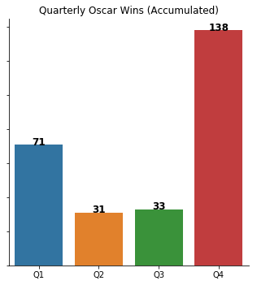
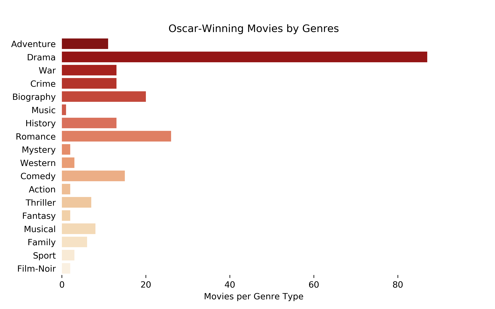
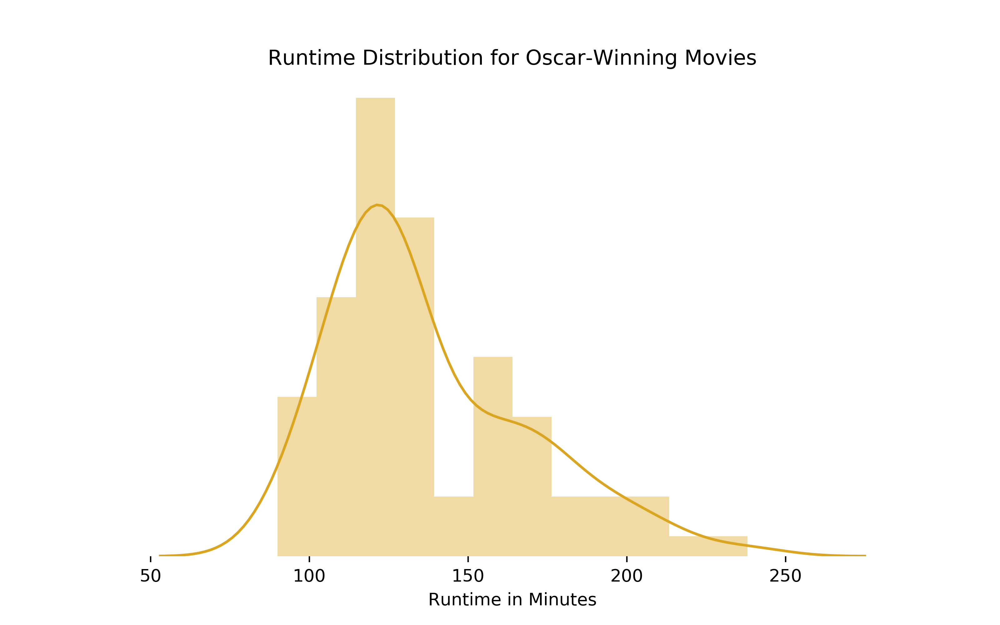

# Predicting Academy Award winners in the category 'Best Picture'

This project scrapes IMDB for all Academy Award winning and nominated movies in the category *Best Picture*, with the intention of using
machine learning methods to predict the next winning movie. For each movie a series of data is collected (see section: *dataset*) for the movie, director(s) and actors who worked on it. 

## To do:

- [x] Write final functions for scraping the IMDB sites
- [x] Add budget and box office numbers to dataset
- [x] Re-scrape the IMDB sites for updated content
- [x] Tidy data
- [ ] Apply machine learning algorithm to dataset
- [ ] Analyze the logfiles
- [ ] ***Add more here***

    ### To add/consider for report:
        - Descriptive Statistics table (mean,std,max,min...)
        - Did scraper act in accordance to website policy? 
        - Mention issues with geotrack (data in EN but data in DK)
        - mapping of scraping procedure? (figure showing different branches of scraping process?)

## Descriptive statistics
<p align="center">
    
    
<p align="center">
    
</p>
<p align="center">
    
</p>

 


# Data

The dataset [oscar_movies.csv](oscar_movies.csv) is the all inclusive dataset, and [oscar_movies_ML.csv](oscar_movies_ML.csv) is the machine learning dataset.

## How to use:

The [oscar_scraper.ipynb](oscar_scraper.ipynb) notebook includes all functions required to scrape the sites/subsites. There are three sub functions and a main function:
- `get_movies` (scrapes the list of movies)
- `get_awards` (scrapes the number of acadamy awards each director/actor has been nominated for and won)
- `get_metadata` (scrapes extra data for each movie)
- `get_data` (runs all the scrapers and tidys the data)

#### get_movies:
This function accepts one of two inputs, *'winners'* or *'nominees'*, which will determine which site to scrape. The *'winners'* input scrapes [this](https://www.imdb.com/search/title/?count=100&groups=oscar_best_picture_winners&sort=year,desc&ref_=nv_ch_osc) site, whereas the *'nominees'* scrapes [this](db.com/search/title/?groups=oscar_best_picture_nominees&start=1&ref_=adv_nxt) and subsequent pages. 

```
get_movies(winners_or_nominees)
```

The output is a dataframe containing following columns:

['index', 'title', 'year', 'runtime_min', 'genre', 'metascore', 'gross_mil', 'link_movie', 'director', 'actors', 'link_people']

The *index* referes to the index of the IMDB page. The two link columns, *link_movie* and *link_people*, include links to the individual movies site on IMDB, and to each of the director(s)/actors awards page. The columns *genre*, *director*, *actors* and *link_people* are all lists.

#### get_awards:
This function accepts one input, a list of urls for director/actor IMDB pages. The list comes from the column *link_people*, from the output of the `get_movies` function. This outputs a list with tuples, that has the sum of nominations and winnings for all the directors/actors of each movie.

```
get_awards(actorlist)
```

#### get_metadata:
This functions accepts one input, a url to the IMDB movie page. The url comes from the columns *link_movie*, from the output of the `get_movies` function. This outputs a dataframe with following columns:

['country', 'language', 'release_date', 'budget', 'color', 'aspect_ratio']

```
get_metadata(movie_url)
```

### get_data()

```
def get_data():
    win_nom = []
    
    for movie_list in ['winners', 'nominees']:
        print('... Initializing "%s" scraper ...' %movie_list)
        
        movies   = get_movies(movie_list)
        print('... Movies has been scraped ...')
    
        awards   = [get_awards(i) for i in movies.link_people]
        print('... Awards has been scraped ...')
        
        metadata = [get_metadata(i) for i in movies.link_movie]
        print('... Metadata has been scraped ...')
    
        awards   = pd.DataFrame(awards, columns=['nom_people_sum', 'won_people_sum'])
        metadata = pd.DataFrame(metadata)

        df = movies.merge(awards, left_index = True, right_index = True)
        df = df.merge(metadata, left_index = True, right_index = True)
        
        df.to_csv('oscar_%s.csv' % movie_list)
        print('... CSV file: oscar_%s.csv has been created ...' % movie_list)
        
        win_nom.append(df)
        
    return win_nom
```

Output while running:

```
... Initializing "winners" scraper ...
... Movies has been scraped ...
... Awards has been scraped ...
... Metadata has been scraped ...
... CSV file: oscar_winners.csv has been created ...
... Initializing "nominees" scraper ...
... Movies has been scraped ...
... Awards has been scraped ...
... Metadata has been scraped ...
... CSV file: oscar_nominees.csv has been created ...
```

### Merging datasets

```
nom = nom.assign(won_oscar = lambda nom: nom.title.isin(win.title))
```


## Contributers:
@JohannesHoseth
@Benny-ucph
@akaisin
@bijantaheri
